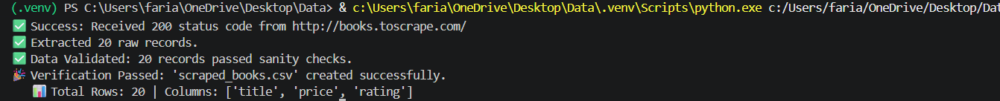
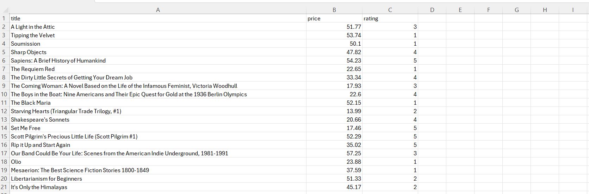
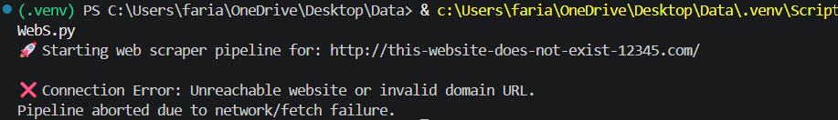

# Web Scraper & Data Cleaner

A Python application that collects book data from a public web-scraping practice website, cleans and validates the data, and exports the results as a structured CSV dataset.

## Project Overview

This project demonstrates a complete data-processing workflow:

**Fetch → Extract → Clean → Validate → Export**

The application:

* Fetches webpage content using `Requests`
* Parses HTML using `BeautifulSoup`
* Extracts book titles, prices, and ratings
* Converts raw values into usable numeric data
* Removes incomplete and duplicate records
* Validates the cleaned dataset
* Exports the final results to CSV
* Verifies that the output file was created successfully

## Demo

### Successful Run



The scraper successfully connected to the website, extracted 20 records, validated the data, and generated the CSV output.

### Cleaned Dataset



The resulting dataset contains three structured fields:

* `title`
* `price`
* `rating`

### Error Handling



The application handles connection failures and invalid URLs without producing an unhandled Python traceback.

## Data Processing

Raw scraped values are transformed into structured data.

Examples:

```text
"£51.77" → 51.77
"Five"   → 5.0
```

The cleaning process also:

* Removes records missing required fields
* Removes duplicate book titles
* Converts prices to numeric values
* Converts ratings from words to numbers

The validation stage checks that:

* Price is greater than 0
* Rating is between 1 and 5
* Title is not empty

## Error Handling

The application includes handling for:

* Invalid or unreachable URLs
* Connection failures
* Request timeouts
* HTTP errors
* Unexpected webpage structures
* Missing data
* Invalid prices
* Invalid ratings
* Empty datasets
* CSV export failures

The goal is to fail gracefully and provide useful feedback instead of producing an unhandled traceback.

## Output

The program creates:

```text
scraped_books.csv
```

Example structure:

| title                | price | rating |
| -------------------- | ----: | -----: |
| A Light in the Attic | 51.77 |      3 |
| Tipping the Velvet   | 53.74 |      1 |
| Soumission           | 50.10 |      1 |
| Sharp Objects        | 47.82 |      4 |

The test run successfully produced **20 validated records**.

## Technologies

* Python
* Requests
* BeautifulSoup
* Pandas
* Regular Expressions
* CSV processing

## Data Source

This project uses [Books to Scrape](https://books.toscrape.com/), a public website designed specifically for practicing web scraping.

## How to Run

Install the required libraries:

```bash
pip install requests beautifulsoup4 pandas
```

Run the application:

```bash
python DataCWebS.py
```

The program will fetch the webpage, extract the data, clean and validate it, and create `scraped_books.csv`.

## Skills Demonstrated

This project demonstrates practical experience with:

* Python programming
* Web scraping
* HTML parsing
* Data cleaning
* Data validation
* Pandas DataFrames
* Regular expressions
* Exception handling
* CSV processing
* Modular programming
* Building a complete data-processing pipeline
